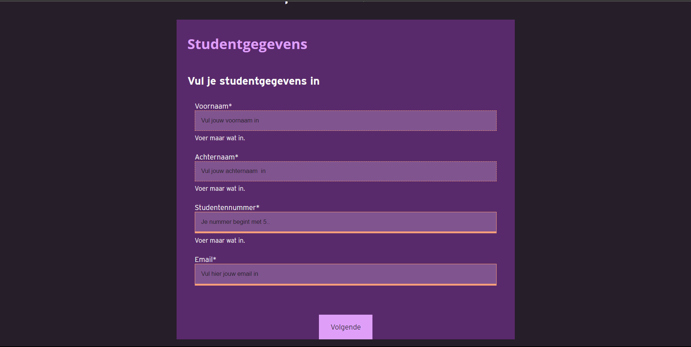
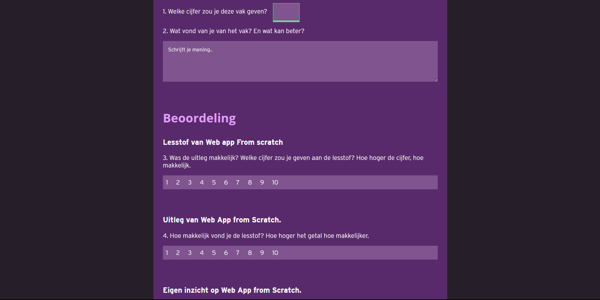
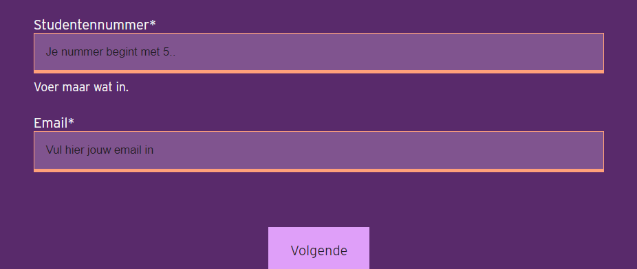
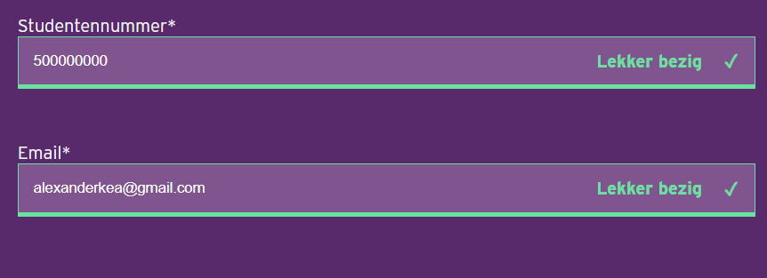
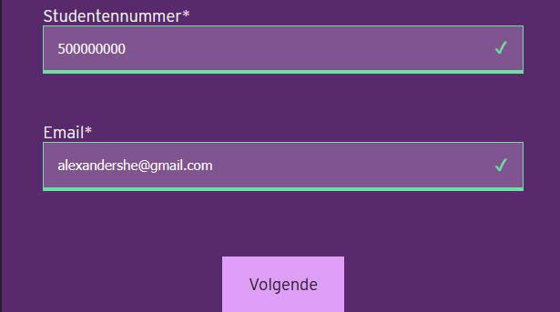

# Enquête voor Minor Web
In de vak van browser technologie ga ik een robuuste en toegankelijk website maken. Mijn website moet zo goed mogelijk kunnen werken op alle browser, alle schermen en in verschillende soorten contexten. Dus ik moet nadenken over responsive pagina's, goeie kleurcontrasten, fallback lettertype, alt teksten bij afbeeldingen etc. Verder ga ik onderzoek over wat progressive enhancement is om een toegankelijk website te maken. Voor mijn eindopdracht ga ik een Enquete maken voor studenten die  Minor web heb gevolgd. De bedoeling dat de studenten hun ervaring geven die ze hebben meegemaakt tijdens de minor.

---

## Concept
- Link naar de Demo: https://k3a101.github.io/Minor-Web-Enquete-Formulier/


Ik heb een design gemaakt voor de enquete. Mijn enquete bestaat uit een pagina waar de studenten hun gegevens kan invullen zoals hun email, studentennummer, naam en achternaam. Maar ik denk bij een enquete hoeft je eigenlijk geen persoonlijk gegevens invullen, want anders krijg je geen eerlijke antwoord. Dus deze pagina moet eigenlijk optioneel zijn. Maar voor school doeleinden wilde ik de validatie laten zien die ik heb gemaakt met css. Als je op de volgende knop gaat, dan krijg je de vragenlijst voor de vakken. Er is totaal acht vakken. Dus elke vak heeft een vragenlijst met vijf vragen.

De vragen:
1. Welke cijfer zou je deze vak geven?
1. Wat vond van je van het vak? En wat kan beter?
1. Was de uitleg makkelijk? Welke cijfer zou je geven aan de uitleg? Hoe hoger de cijfer, hoe makkelijk.
1. Was de lesstof makkelijk? Welke cijfer zou je geven aan de lesstof? Hoe hoger de cijfer, hoe makkelijk.
1. Hoe goed kon je het vak Web app From scratch begrijpen? Hoe hoger de cijfer, hoe beter.






---
## Functionaliteiten van het Prototype
De enquete moet op bepaalde voorwaarde doen en die voorwaarden moet alle browser werken, op verschillende scherm grootte en ook als bepaalde features uit is zoals cookies en Javascript. Onderaan staan de core functionaliteiten die  op elke moment zo goed moeten werken. 

### Core functionaliteiten voor de enquête - Zelf bedacht
- foutmelding, wat is er fout ingevuld wanneer je op de submit klit
- Hoe je de foutmelding presenteert
- Niet alle informatie tegelijkertijd.

### Browsers die ik ga gebruiken:
- Safari op desktop en Iphone
- Google Chrome desktop en mobiel
- Firefox desktop en mobiel
- Samsung Internet mobiel
- UC browser/PrinceXML

## Nice To have

<details>
<summary>Nice to have voor de enquête</summary>

- Het formulier moet duidelijk zijn zonder css. 
- Dus labels, input en de submit knop moet kunnen werken.
- Gebruikers moet duidelijk zien wat voor soort informatie ingevuld is.
- Aangeven welke invoervelden verplicht is om in te vullen
- Formulier moet een goede contrast hebben tussen de voorgrond en de achtergrond.
- Placeholder tekst in de labels, zodat de gebruiker weet wat voor soort informatie ingevuld moet worden.
- Buttons om naar de volgende pagina te gaan moet werken.
- Aangeven waar je bent in het formulier.
- Gebruikers moeten weten dat ze de goeie informatie had hevuld
- Mensen die assistive technology moeten de enquete kunnen invullen
- Je kan met een toetsenbord de pagina navigeren en bedienen.
- Je kan het enquete invullen op kleinere schermen 

</details>


---

## Criteria voor de eindopdracht
Voor de beoordeling  werd er verschillende criteria's opgesteld die moet werken op alle genoemde browsers en ook zonder javascript. Ik ga per criteria grondig uitleggen hoe ik heb ze allemaal heb aangepakt.

- Zorg ervoor dat de gebruiker niet teveel formuliervelden in 1 keer ziet.
- Validatie: Zorg ervoor dat het formulier compleet wordt ingevuld. Geef duidelijke foutmeldingen. Bedenk zelf wanneer en hoe de validatie zal plaatsvinden.
- Als ik de enquete niet afkrijg, wil ik later weer verder gaan met waar ik ben gebleven.
- Duidelijke interface waarmee gebruiker terug kan naar vorige vragen. (En misschien ook om een vraag over te slaan?)
- Duidelijke interface die aangeeft waar je bent in het formulier
- Je mag geen zichtbare radio buttons gebruiken
- Het formulier moet een light mode en dark mode hebben.


## 1. Niet alle formuliervelden laten zien
Ik heb dit criteria opgelost door de vakken te verdelen  op een HTML pagina. Dus een vak heef zijn eigen html pagina. Ik heb ze allemaal gekoppeld met `<a>` tag. Dus ik heb bovenaan een lijst met de html pagina's linkt. Dus het zorgt ervoor dat de gebruiker terug kan gaan of een vraag kan skippen. Zonder deze oplossing blijft het een hele lange formulier. Dus deze manier kan ook zonder javascript werken. 

## 2. Formulier validatie
Bij formulier validatie wordt ervoor gezorgt dat de gebruiker de juiste informatie in het formulier invult. Belangrijk bij de validatie zijn dat je moet aangeven wat de gebruiker fout heeft ingevuld.  Bij de formulier validatie heb je te maken met progressive enhancement. Want in de Html heb je al ingebouwde formulier validatie. In de css heb je de `:valid` en`invalid` pseudo selectors en als meer vette foutmelding wil doen kan je javascript gebruiken.

### Formulier validatie met HTML 
Om je formulier te valideren met alleen de HTML moet je alvast je de juiste input types gebruiken zoals, `input type="email"`,`input type="radio"`,`input type="text"`,`input type="checkbox"`ect. Als je de juiste input gebruikt, kun je al ervoor zorgen dat er de juiste datatypes wordt ingevuld wordt.  Om een vraag verplicht te naken heb ik de   `required` atrribute gebruikt. Het zorgt ervoor dat je niet de formulier  kan versturen zonder de verplichte invoervelden in te vullen. 
Hier is een voorbeeld van mijn formulier:


```html
         <label for="voornaam">Voornaam*
                    <input type="text" name="voornaam" id="voornaam" aria-required="true" required
                        placeholder="Vul jouw voornaam in" aria-placeholder="Vul jouw voornaam in">
                        <span></span>
                </label><br>

                <label for="achternaam">Achternaam*
                    <input type="text" name="achternaam" id="achternaam" aria-required="true" required
                        placeholder="Vul jouw achternaam  in" aria-placeholder="Vul jouw achternaam in">
                        <span></span>
                </label><br>

                <label for="studentennummer">Studentennummer*
                    <input type="text" inputmode="numeric" name="studentennummer" required id="studentennummer" placeholder="Je nummer begint met 5.."
                        aria-placeholder="Studentennummer begint met 5" minlength="1" maxlength="9"  pattern="[5-6][0-9]{8}">
                        <span></span>
                </label><br>

                <label for="email">Email*
                    <input type="email" name="email" id="email" required placeholder="Vul hier jouw email in"
                        aria-placeholder="Vul hier jouw email in">
                        <span></span>
                </label>


```

In HTML heb je verschillende atributen die ervoor zorgt dat je de juiste data in het formulier moet invullen. Een voorbeeld van mij is bij de studentennummer. Het is verplicht om je studenten nummer in te vullen. Hiermee heb ik de `required` atribuut te gebruiken, verder heb ik ook de minimale en maximale  waarde die je kan invullen gebruikt met de `minlength` en `maxlength`. Met deze twee atributen wordt ervoor gezorg dat je de juiste aantal nummers invult. De data wordt niet geldig totdat je de studentennummer had ingevuld. 

Belangrijke atrributen bij HTML die ik heb gebruikt.
- `placeholder`: Je geeft visueel aan wat voor soort informatie je moet invullen
- `type`: Geeft aan voor soort invoerveld het is 
- `required`: Maakt de input verplicht om in te vullen. 
- `minlength`: minimale waarde die ingevuld moet worden;
- `maxlength`: maximale waarde die ingevuld moet worden.

## Formulier valideren  met CSS
Ik heb ondekt dat je met css foutmeldingen kan maken met de `:valid `en `:invalid` pseudo classes. Maar de enige nadeel van deze psuedo classes zijn dat ze per direct aan zijn voordat de gebruiker iets mee doet. 


### Met de :invalid selector



```css
/* Wanneer de invoerveld ongeldig is dan krijgt die oranje rand */
input[type="email"]:invalid,
input[inputmode="numeric"]:invalid {
    border: 1px solid var(--invalid-form-data-kleur);
    border-bottom: 4px solid var(--invalid-form-data-kleur);
}
```
Ik wilde een effect met css maken waarvan de gebruiken een melding krijgt wanneer ze niks in het verplichte formulieren had ingevuld. 
Ook heb ik een bericht toegevoegd "vul maar iets in" Ik heb een `span` geplaats na de input.En met de sibling selector  en daarna met de `::after` selector heb ik in de content property de tekst geplaatst. 

```css
/* Zonder :has() */
#studentgegevens label input[type="text"]:invalid+span::after {
    content: 'Voer maar wat in. ';
    position: absolute;
    transform: translateY(.5em);
    font-size: 14px;

}
```

### Met de valid Selector 
#### In chrome


Hier heb ik de `:valid` selector gebruikt. Deze state wordt geactiveerd wanneer de gebruiker de juiste informatie heb ingevuld. Ik heb daarbij een motivatie bericht (lekker bezig) toegevoegd met de `content` property in de after selector. Maar hier heb ik wel de has gebruikt. Voor firefox die geen has selector ondersteunen zie je alleen maar de vinkje. 

```css

#studentgegevens label:has(input[type="text"]:valid)::after {
    content: 'Lekker bezig';
    color: var(--valid-form-data-kleur);
    position: absolute;
    font-weight: bold;
    transform: translateY(2em);
    right: 5em;
}


#studentgegevens label:has(input[type="email"]:valid)::after {
    content: 'Lekker bezig';
    color: var(--valid-form-data-kleur);
    position: absolute;
    font-weight: bold;
    transform: translateY(2em);
    right: 5em;
}

```


#### In Firefox

Omdat in firefox geen has ondersteund zien de gebruiker niet de lekker bezig zoals bij de chrome browser. Maar ze weten wel dat ze de juiste informatie hadden ingevuld.

```css

#studentgegevens label input[type="text"]:valid+span::after {
    content: '\2713';
    color: var(--valid-form-data-kleur);
    position: absolute;
    font-weight: bold;
    transform: translateY(-2.3em);
    right: 3em;
}

#studentgegevens label input[type="text"]:invalid+span::after {
    content: 'Voer maar wat in. ';
    position: absolute;
    transform: translateY(.5em);
    font-size: 14px;

}

```


### Formulier valideren in javascript


---

## 3. Data opslaan en later weer verder gaan
In mijn prototype is het mogelijk om met het enquete op een andere moment afmaken en verder gaan waar je bent gebleven. Ik heb gebruikt gemaakt van de localstorage. Het localstorage is een client-side database vanuit de browser waar de gebruikersdata kan opslaan. Je kan de data opslaan en ook ophalen. Hiermee heb ik javascript gebruikt. 

### Hoe werkt het?
Als de gebruiker iets invoert wordt de name en de value van de data opgeslagen. Om de data naar de localstorage te sturen gebruik ik de `.setItem()` methode. De name atribuut moet duidelijk zijn zodat je weet wat voor soort data het erover gaat. Verder om de data op te halen had ik de `.getItem()` gebruikt. 


```javascript

const formInputs = document.querySelectorAll('input[type="text"] , input[type="email"]');
function saveFormInputsToLocal() {
    // Loop alle form input en stuurt de waarde naar de localstorage
    formInputs.forEach(input => {
        let inputName = input.name; //Pakt de naam van de input element
        let inputValue = input.value; // Pakt de recente gevulde waarde
        localStorage.setItem(inputName, inputValue); // De waarde in de localstorage opslaan.
       
    });
}
// Haal al de opgeslagen data vanuit de localstorage en zet het terug in het formulier

function loadFormInputToLocal() {
    formInputs.forEach(input => {
        const inputName = input.name;
        let storedValue = localStorage.getItem(inputName);
        if(storedValue){
            input.value = storedValue
        }
    });
}

// Eventlistener toevoegen bij alle invoervelden
formInputs.forEach(input => {
    input.addEventListener('input', saveFormInputsToLocal);
});

// De functie roepen
loadFormInputToLocal();

```
Hier selecteer ik alle iputs vanuit de html, per input pakt ik de value en de name atribuut en zetten ze in de localstorage. Daarna haal ik alle waarde vanuit de localstorage met de `.getItem() `methode.


Briefing van de server side 
- Kijken wat niet wekren op 
- Wat moet de server doen
- Voorbeeldpagina maken


---


## Progressive enhancement
- Layout
- Positionering
- Fonts
- Form Validatie
- 

---
# Testen
## Geteste features

### Javascript uitzetten

### Cookies uitzetten

### Slechte internet verbinding

### Geen Custom fonts

### Cookies uitzetten


## Browsers

## Chrome

## Safari

## Firefox

## Samsung Internet

## PrinceXM